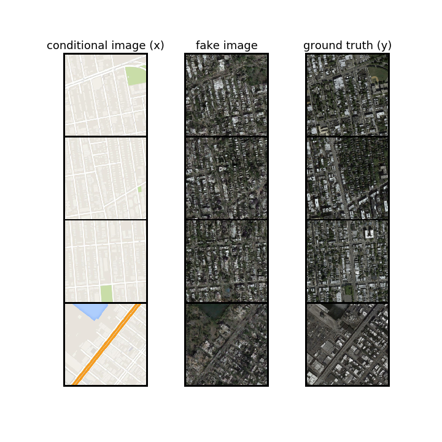
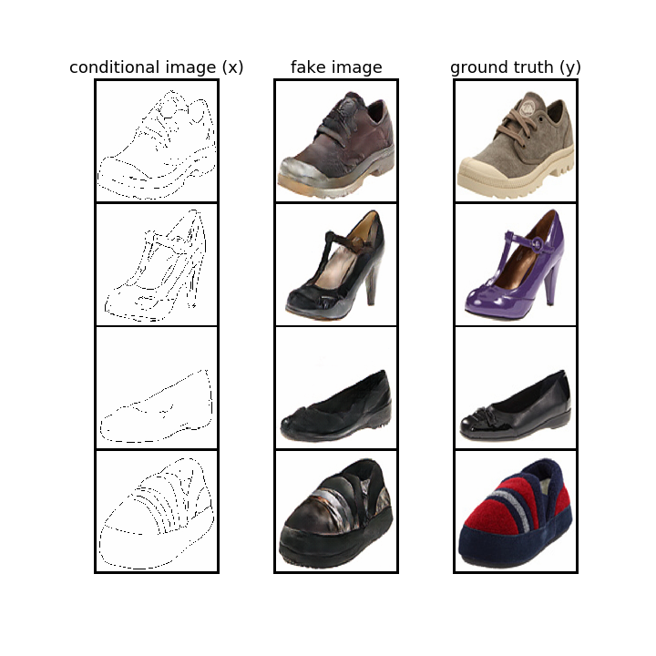
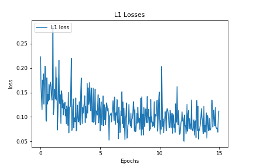
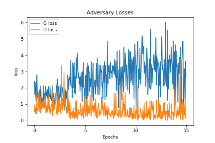
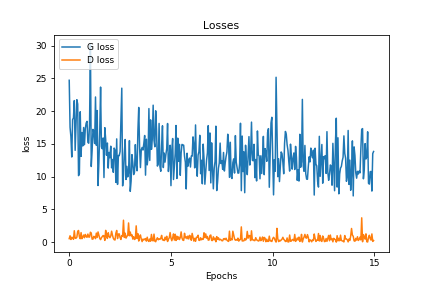

# pix2pix-pytorch
A pytorch implementation of "Image-to-Image Translation with Conditional Adversarial Networks"

## Results

maps to aerial photos

edges to shoes

L1 losses (for Generator)

Adversarial loss

Entire losses

